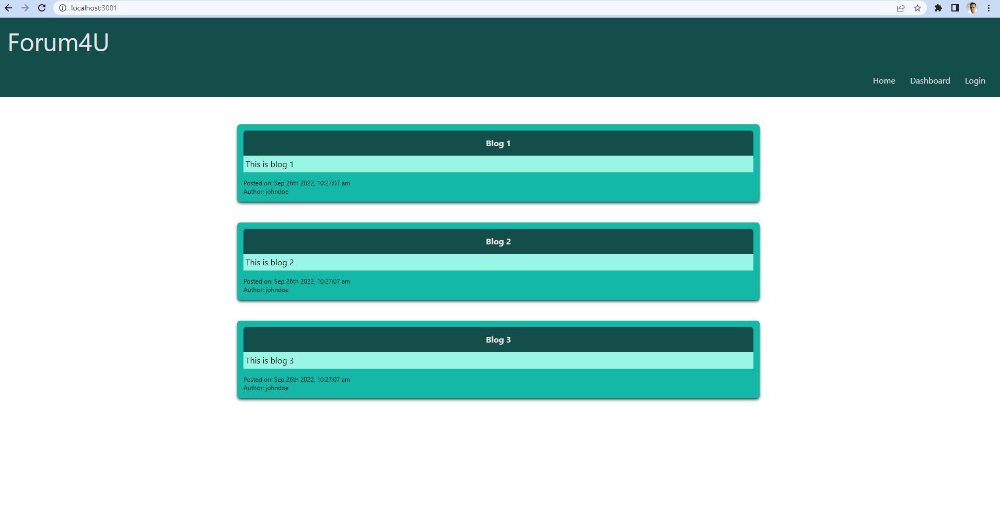

# DnD Character Generator [](https://opensource.org/licenses/MIT)

This is a full stack web application that creates, updates, reads, and deletes forums posts and limits user interaction based on if they are loggin in or not. [MIT License](https://opensource.org/licenses/MIT)

## Table of Contents

- [Installation](#installation)
- [Usage](#usage)
- [License](#license)
- [Contributing](#contributing)
- [Tests](#tests)
- [Questions](#questions)

## Installation

To install the application, run the following code...

```shell
npm install
npm run seed
npm start
```

## Usage

First create user profile, then create a blog. You can update and delete the blog as well as comment.

Deployed application: https://sam-march-forum4u.herokuapp.com/
Github repository: https://github.com/SamMarch/14-Model-View-Controller-MVC-Tech-Blog.git



## License

MIT License (MIT) - [MIT License](https://opensource.org/licenses/MIT)

## Contributing

Sam

## Tests

There are no tests for this application.

## Questions

[SamMarch](https://github.com/)

If you have more questions contact me at...
[marchsam1988@gmail.com](marchsam1988@gmail.com)
